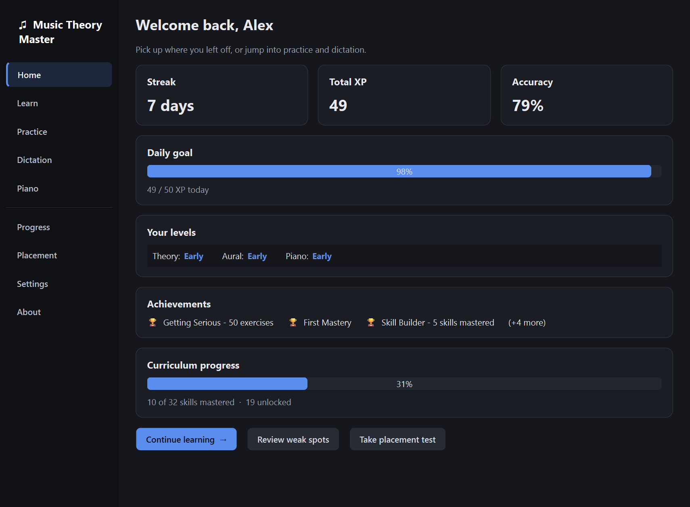
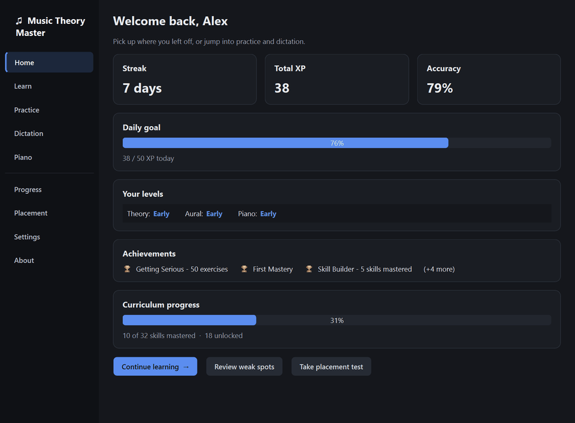
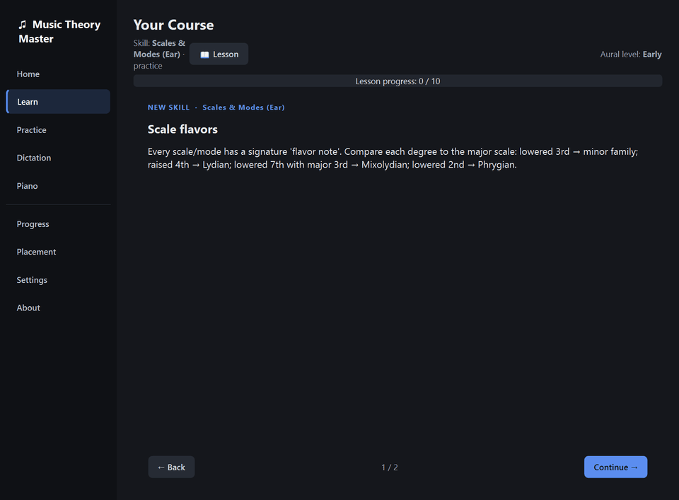
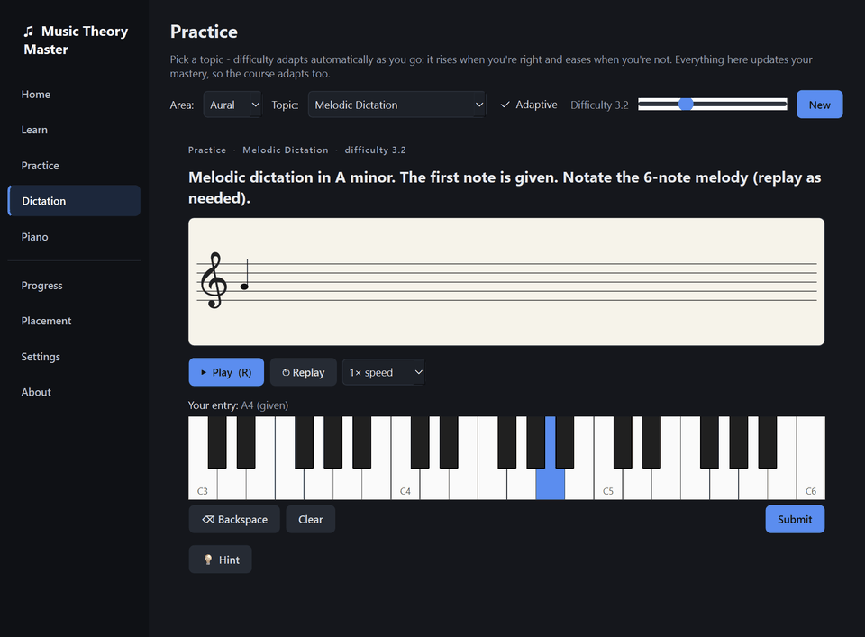
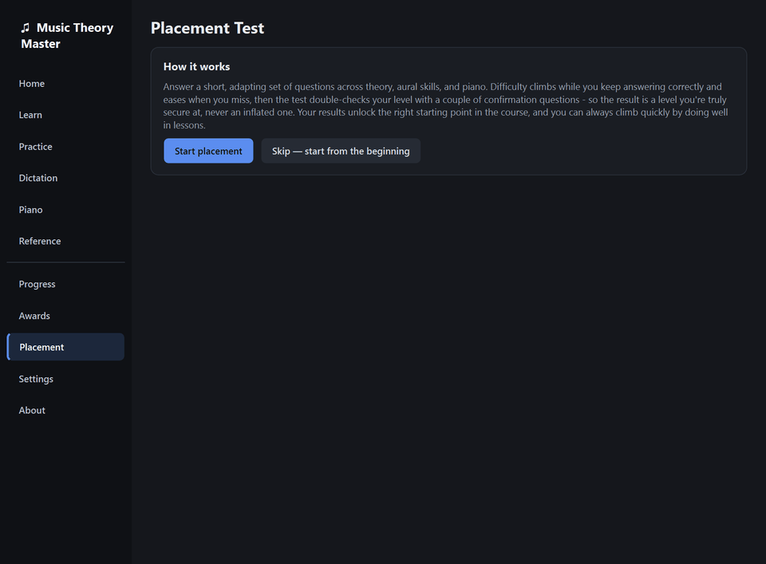

<div align="center">

# ♫ Music Theory Master

**A Duolingo-style desktop trainer for music theory, ear training, and keyboard skills — from "what's a triad?" to graduate-level chops.**

[](https://www.python.org/)
[](https://riverbankcomputing.com/software/pyqt/)
[](#-build-the-exe)
[](#-development)
[](#-privacy--security)

*Adaptive placement → teach-then-drill lessons → spaced review. It meets you where you are and never lets you coast.*



</div>

---

## ✨ What it does

| | |
|---|---|
| 🎯 **Adaptive placement** | A short staircase test across theory, aural, and piano pins down your true level — deliberately conservative, so you're never dropped into material you can't handle. Or skip it and start from the beginning. |
| 📖 **Teach first, then drill** | Every skill opens with a mini-lesson (with playable musical examples and staff illustrations) before you're ever quizzed on it. |
| 🧠 **Real mastery model** | Elo ratings + Bayesian knowledge tracing + FSRS-style spaced review per skill. Weak spots resurface; mastered skills get out of your way. |
| 🎹 **Real musician inputs** | Answer on an on-screen piano (or your MIDI keyboard), notate melodies on a staff, tap rhythms, build chord sequences — not just multiple choice. |
| 👂 **Serious ear training** | Intervals, chord qualities, scales/modes, melodic & harmonic dictation — including multi-voice dictation with per-voice entry and playback-speed control. |
| 🔥 **Progress that motivates** | XP, daily goals, streaks, achievements, per-domain levels, and a full curriculum map. |
| 🔊 **Instant, realistic audio** | Starts on a built-in synth in milliseconds, hot-upgrades to a bundled FluidSynth SoundFont in the background. Ten instruments to choose from. |

## 🎬 Tour

### The app at a glance
Home dashboard, free practice, piano workspace, progress map, and settings.



### Learn: lesson → drill
New skills teach the concept first — short pages with audio examples — then drop you straight into the drill.



### Drills that actually teach
Numbered choices (press 1–9), instant feedback, and a mini-explanation whenever you miss — the right answer is always spelled out.


### Melodic dictation
Listen (replay as much as you like, slow it down without changing pitch), enter what you heard on the piano, and get a staff-notation reveal of your line vs. the answer.



### Placement test
Adaptive difficulty staircase with confirmation questions. During the test your answers are acknowledged but never revealed — no telegraphing, no time pressure.



## 🚀 Getting started

### Run from source

```powershell
git clone https://github.com/Eipckz/music-theory-master.git
cd music-theory-master
pip install -r requirements.txt
python main.py
```

Optional (for realistic SoundFont audio instead of the built-in synth):

```powershell
python build\fetch_audio_assets.py   # one-time, hash-verified download
```

### Build the exe

```powershell
./build.ps1
```

Produces a single self-contained `dist/MusicTheoryMaster.exe` (PyInstaller onefile) plus a `.sha256` checksum file so recipients can verify their copy.

## 🗺️ What's inside

```
music_theory/
├── theory/      pure music math — pitch, scales, chords, roman numerals,
│                set theory, twelve-tone, neo-Riemannian transformations
├── exercises/   50+ exercise generators, difficulty 0–10, self-grading
├── adaptive/    placement staircase, Elo+BKT+FSRS mastery, scheduler
├── curriculum/  skill tree with prerequisites + a mini-lesson for every skill
├── audio/       instant numpy synth → background FluidSynth upgrade, MIDI in
├── ui/          PyQt6 — token-driven dark theme, exercise player, lesson view
└── storage/     SQLite in per-user appdata; your data never leaves your machine
```

The curriculum spans **theory** (notation → counterpoint → post-tonal analysis), **aural skills** (interval recognition → multi-voice dictation), and **keyboard** (note finding → progressions), with placement seeding and prerequisites wiring them together.

## ♿ Accessibility

- Full keyboard play: number keys pick answers, `R` replays audio, `Backspace` deletes entries, `Z`/`X` shift the on-screen piano's octave, `Enter` submits/advances — with a visible focus ring everywhere.
- Screen-reader support: accessible names/descriptions on controls, text alternatives for staff renderings (note names), and results carried on focus changes.
- WCAG-AA contrast across the dark theme; correct/wrong feedback uses icons + words + color, never color alone.
- No time limits, unlimited audio replays, adjustable playback speed for dictation, and UI text that scales with your system font size.

## 🔒 Privacy & security

- **Zero network calls at runtime** — enforced by an automated test that blocks sockets and proves the app still works.
- No telemetry, no accounts. All progress lives in a local SQLite file under your user profile.
- Build-time downloads (FluidSynth DLLs, SoundFont) are pinned to immutable releases and verified against hard-coded SHA-256 hashes.
- No `eval`/`exec`/pickle anywhere; SQL is fully parameterized (also enforced by tests).

## 🧪 Development

```powershell
python -m pytest tests -q     # ~2 min; GUI tests run headless
```

- 198 tests cover the theory engine, every exercise generator contract (self-grades correctly at every difficulty, never crashes), the adaptive models, persistence, GUI flows, and the no-network guarantee.
- New exercise generators are auto-covered: register them and the parametrized suite picks them up.
- Demo media in this README is generated straight from the real app: `python build\make_demo_media.py`.

---

<div align="center">

**Built for musicians who want their theory chops to keep up with their playing.** 🎼

</div>
