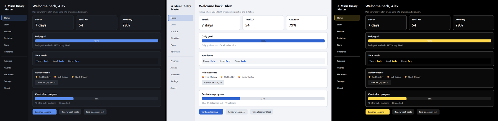
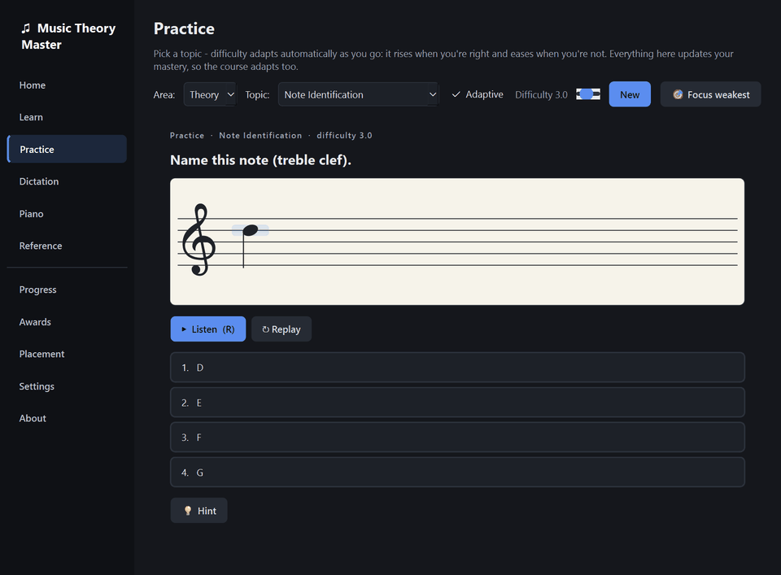
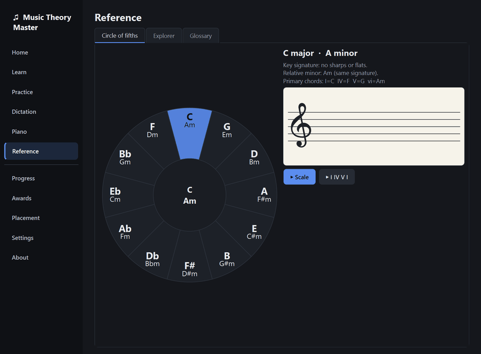
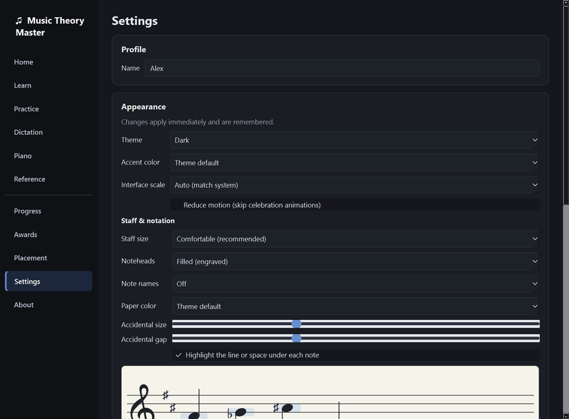
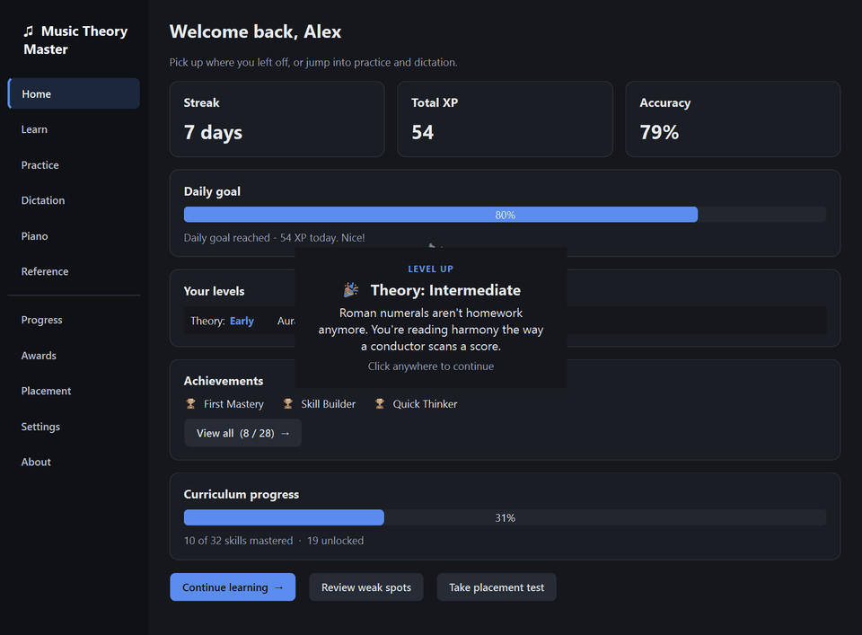

<div align="center">

# ♫ Music Theory Master

**A Duolingo-style desktop trainer for music theory, ear training, and keyboard skills — from "what's a triad?" to graduate-level chops.**

[](https://github.com/Eipckz/music-theory-master/actions/workflows/ci.yml)
[](https://github.com/Eipckz/music-theory-master/releases/latest)
[](https://www.python.org/)
[](LICENSE)
[](#-privacy--security)

*Adaptive placement → teach-then-drill lessons → spaced review. It meets you where you are and never lets you coast.*


</div>

---

## ⬇️ Download for Windows

Grab the latest from the **[Releases page](https://github.com/Eipckz/music-theory-master/releases/latest)** — no Python, no setup scripts:

| File | What it is |
|---|---|
| **`MusicTheoryMaster-Setup.exe`** | Installer with a Start-menu shortcut and uninstaller. **Recommended.** |
| **`MusicTheoryMaster.exe`** | Portable single file. Run it from anywhere, installs nothing. |

Both are fully offline (no accounts, no telemetry) and ship with `.sha256` checksums you can verify. Prefer source? See [Run from source](#-run-from-source).

## ✨ What it does

| | |
|---|---|
| 🎯 **Adaptive placement** | A short staircase test across theory, aural, and piano pins down your true level — deliberately conservative, so you're never dropped into material you can't handle. Or skip it and start from the beginning. |
| 📖 **Teach first, then drill** | Every skill opens with a mini-lesson (with playable musical examples and staff illustrations) before you're ever quizzed on it. |
| 🧠 **Real mastery model** | Elo ratings + Bayesian knowledge tracing + FSRS-style spaced review per skill. Weak spots resurface; mastered skills get out of your way. |
| 🎹 **Real musician inputs** | Answer on an on-screen piano (or your MIDI keyboard), notate melodies on a staff, tap rhythms, build chords in inversion — not just multiple choice. |
| 👂 **Serious ear training** | Intervals, chord qualities, scales/modes, progression recognition, melodic & harmonic dictation — including multi-voice dictation with per-voice entry and playback-speed control. |
| 📚 **Built-in reference** | An interactive circle of fifths, a staff/keyboard explorer for any scale or chord, and a playable glossary — the "look it up" side of theory, one click away. |
| 🔥 **Progress that motivates** | XP, daily goals, streaks, 28 achievements with a gallery, celebration moments, and hundreds of musician-written encouragements that never repeat. |
| 🎨 **Make it yours** | Dark, light, high-contrast, and sepia themes; accent colors; UI scaling; staff size, notehead style, and note-name labels — all live, all remembered. |
| 🔊 **Instant, realistic audio** | Starts on a built-in synth in milliseconds, hot-upgrades to a bundled FluidSynth SoundFont in the background. Ten instruments to choose from. |

## 🆕 What's new in 1.0

- **Engraved staff rendering** — metrics-placed accidentals (no more flats colliding with noteheads), tilted noteheads with correct stem direction, chord stacking with accidental lanes, whole/half/quarter values, time signatures and barlines.
- **Appearance system** — four WCAG-AA themes, accent colors, interface scale, and a full staff-appearance panel with live preview.



- **Celebrations that mean something** — distinct moments for level-ups, skill mastery, and daily goals, with a no-repeat bank of 768 concept-grounded messages (and a reduce-motion toggle).
- **New exercises** — note placement, key-signature building, chord-inversion construction, progression recognition by ear.
- **Reference tab** — circle of fifths, explorer, glossary.
- **One-click install** — CI-built releases with installer + portable exe.

## 🎬 Tour

### The app at a glance
Home dashboard, practice, piano workspace, reference, progress, awards, and settings.


### Learn: lesson → drill
New skills teach the concept first — short pages with audio examples — then drop you straight into the drill.


### The staff, properly engraved
Clean accidental spacing out of the box, readable noteheads, and construction exercises where you build the answer in notation.



### Drills that actually teach
Numbered choices (press 1–9), instant feedback, and a mini-explanation whenever you miss — the right answer is always spelled out.


### Melodic dictation
Listen (replay as much as you like, slow it down without changing pitch), enter what you heard on the piano, and get a staff-notation reveal of your line vs. the answer.


### Circle of fifths
Click any key: signature, relative minor, primary chords — and hear it.



### Themes
Switch the whole app live from Settings; staff and keyboard follow.



### A level-up, celebrated
Short, dismissible, and honest — it names what you just earned.



### Placement test
Adaptive difficulty staircase with confirmation questions. During the test your answers are acknowledged but never revealed — no telegraphing, no time pressure.


## 🚀 Run from source

```powershell
git clone https://github.com/Eipckz/music-theory-master.git
cd music-theory-master
pip install -r requirements.txt
python main.py
```

Optional (for realistic SoundFont audio instead of the built-in synth):

```powershell
python build\fetch_audio_assets.py   # one-time, hash-verified download
```

### Build the exe yourself

```powershell
pip install -r requirements-dev.txt
./build.ps1
```

Produces a single self-contained `dist/MusicTheoryMaster.exe` (PyInstaller onefile) plus a `.sha256` checksum. Tagged releases build both the exe and the Inno Setup installer automatically in CI.

## 🗺️ What's inside

```
music_theory/
├── theory/      pure music math — pitch, scales, chords, roman numerals,
│                set theory, twelve-tone, neo-Riemannian transformations
├── exercises/   55+ exercise generators, difficulty 0–10, self-grading
├── adaptive/    placement staircase, Elo+BKT+FSRS mastery, scheduler
├── curriculum/  skill tree with prerequisites + a mini-lesson for every skill
├── audio/       instant numpy synth → background FluidSynth upgrade, MIDI in
├── ui/          PyQt6 — themeable token-driven UI, engraved staff widget,
│                exercise player, celebrations, reference tools
└── storage/     SQLite in per-user appdata; your data never leaves your machine
```

The curriculum spans **theory** (notation → counterpoint → post-tonal analysis), **aural skills** (interval recognition → multi-voice dictation), and **keyboard** (note finding → progressions), with placement seeding and prerequisites wiring them together.

## ♿ Accessibility

- Full keyboard play: number keys pick answers, `R` replays audio, `Backspace` deletes entries, `Z`/`X` shift the on-screen piano's octave, `Enter` submits/advances — with a visible focus ring everywhere.
- Screen-reader support: accessible names/descriptions on controls, text alternatives for staff renderings (note names), and results carried on focus changes.
- WCAG-AA contrast across **all four themes** (checked by automated tests), a dedicated high-contrast theme, and a reduce-motion setting; correct/wrong feedback uses icons + words + color, never color alone.
- No time limits, unlimited audio replays, adjustable playback speed for dictation, UI scaling to 200%, and optional note-name labels on the staff and keyboard.

## 🔒 Privacy & security

- **Zero network calls at runtime** — enforced by an automated test that blocks sockets and proves the app still works. See [SECURITY.md](SECURITY.md).
- No telemetry, no accounts. All progress lives in a local SQLite file under your user profile.
- Build-time downloads (FluidSynth DLLs, SoundFont) are pinned to immutable releases and verified against hard-coded SHA-256 hashes.
- No `eval`/`exec`/pickle anywhere; SQL is fully parameterized (also enforced by tests).

## 🧪 Development

```powershell
pip install -r requirements.txt -r requirements-dev.txt
python -m pytest tests -q     # ~2.5 min; GUI tests run headless
```

- 258 tests cover the theory engine, every exercise generator contract (self-grades correctly at every difficulty, never crashes), the adaptive models, persistence, theming/contrast, GUI flows, and the no-network guarantee. CI runs them on Windows and Linux.
- New exercise generators are auto-covered: register them and the parametrized suite picks them up. See [CONTRIBUTING.md](CONTRIBUTING.md).
- Demo media in this README is generated straight from the real app: `python build\make_demo_media.py`.

---

<div align="center">

**Built for musicians who want their theory chops to keep up with their playing.** 🎼

*Designed and built with Claude (Fable 5).*

</div>
