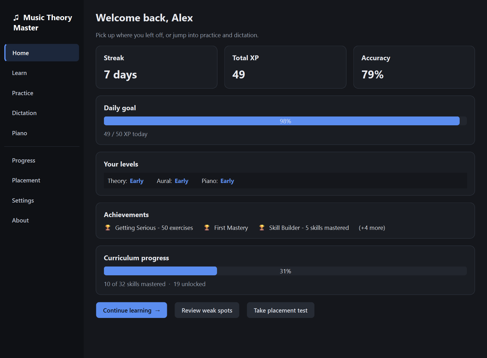

<div align="center">

# ♫ Music Theory Master — A Tool Created by Fable Five and ChatGPT 6 Astra

**An offline music-theory trainer and customizable SATB assignment workbench, with a guided path through Musicianship III–IV before introductory post-tonal and graduate topics.**

[](https://github.com/Eipckz/music-theory-master/actions/workflows/ci.yml)
[](https://github.com/Eipckz/music-theory-master/releases/latest)
[](https://www.python.org/)
[](LICENSE)
[](#-privacy--security)

*Adaptive placement → teach-then-drill lessons → spaced review. It meets you where you are and never lets you coast.*



</div>

---

## ⬇️ Download for Windows

Grab the latest from the **[Releases page](https://github.com/Eipckz/music-theory-master/releases/latest)** — no Python, no setup scripts:

| File | What it is |
|---|---|
| **`MusicTheoryMaster-Setup.exe`** | Installer with a Start-menu shortcut and uninstaller. **Recommended.** |
| **`MusicTheoryMaster.exe`** | Portable single file. Run it from anywhere, installs nothing. |

Both are fully offline (no accounts, no telemetry) and ship with `.sha256` checksums you can verify. Prefer source? See [Run from source](#-run-from-source).

## ✨ What it does

| | |
|---|---|
| 🎯 **Adaptive placement** | A short staircase test across theory, aural, and piano pins down your true level — deliberately conservative, so you're never dropped into material you can't handle. Or skip it and start from the beginning. |
| 📖 **Teach first, then drill** | Every skill opens with a mini-lesson (with playable musical examples and staff illustrations) before you're ever quizzed on it. |
| 🧠 **Real mastery model** | Elo ratings + Bayesian knowledge tracing + FSRS-style spaced review per skill. Weak spots resurface; mastered skills get out of your way. |
| 🎹 **Real musician inputs** | Answer on an on-screen piano (or your MIDI keyboard), notate melodies on a staff, tap rhythms, build chords in inversion — not just multiple choice. |
| 👂 **Serious ear training** | Intervals, chord qualities, scales/modes, progression recognition, melodic & harmonic dictation — including multi-voice dictation with per-voice entry and playback-speed control. |
| 🎼 **Assignment solver** | Add as many chord slots as needed, paste aligned assignment rows, and supply any mix of soprano/alto/tenor/bass clues. Use Roman numerals, figures, chord symbols, or custom note collections; compare validated completions, hear them, and export JSON/MusicXML. |
| 🎒 **Musicianship III–IV** | Seven focused skills with lessons and graded drills: modal degrees, V7 tendencies, non-chord tones, cadences/phrases, applied dominants, mixture/chromatic predominants, and modulation. Prerequisites connect these to advanced and post-tonal study. |
| 🎓 **Pre-Graduate bridge** | A deliberate step between advanced tonal study and graduate analysis: pitch-class clocks, sets, interval vectors, Forte tables, twelve-tone matrices, and P/L/R—taught and drilled in theory, aural, and piano. |
| 📚 **Built-in reference** | Interactive circles of fifths and pitch classes, a staff/keyboard explorer, live set analyzer, 12×12 row matrix, P/L/R workbench, and playable glossary. |
| 🔥 **Progress that motivates** | XP, daily goals, streaks, 28 achievements with a gallery, celebration moments, and hundreds of musician-written encouragements that never repeat. |
| 🎨 **Make it yours** | Dark, light, high-contrast, and sepia themes; accent colors; UI scaling; staff size, notehead style, and note-name labels — all live, all remembered. |
| 🔊 **Instant, realistic audio** | Starts on a built-in synth in milliseconds, hot-upgrades to a bundled FluidSynth SoundFont in the background. Ten instruments to choose from. |

## 🆕 What's new in 1.1

- **The previously unreleased lab and bridge now have their own release version.** The August 25 implementation remained in draft PR #3 and was absent from the June v1.0.0 downloads.
- **Assignment-first entry** — paste multiple rows of clues, add/duplicate/reorder slots, and keep every supplied pitch immutable during solving. Blank chords can use diatonic triads and sevenths in every inversion, including at the beginning of a phrase; specify chromatic alternatives explicitly.
- **Expanded chord entry** — suspended, added-tone, altered and extended symbols through bundled music21, plus root-first custom `notes:C E G Bb` collections. Four-voice extended reductions retain the bass, third, seventh when present, and highest extension; explicit required tones are never silently omitted.
- **Musicianship III–IV preparation** — a visible roadmap and seven teach-then-drill skills before the existing post-tonal bridge. This is a practice sequence, not a substitute for an instructor's syllabus.
- **Search controls and accuracy** — adjustable time and width, cancellation during candidate generation, honest bounded-search status, profile-aware cache invalidation, and rejection of stale results after edits.

- **Offline Four-Part Writing Lab** — deterministic profile-driven SATB solving, checking, targeted correction, generated practice, grand-staff/open-score notation, local audio, JSON save/open, and MusicXML export. Common Practice and Classroom Strict ship built in; custom rule severities, weights, and ranges stay local.
- **Fall 2026 course companion** — an offline guide and milestone checklist for MUS 2710, MUS 2730, and MUS 2750, derived from the supplied syllabi and explicitly marked tentative wherever Canvas or the instructor remains authoritative.
- **Pre-Graduate curriculum layer** — a new level between Advanced and Graduate. It begins with the difference between key-dependent scale degrees and fixed 0–11 pitch classes, then scaffolds the chromatic clock, interval classes, normal/prime form, interval vectors, Forte labels, Tn/TnI, twelve-tone rows/matrices, and neo-Riemannian P/L/R. Coordinated aural and keyboard skills keep the material musical rather than purely numerical.

- **Engraved staff rendering** — metrics-placed accidentals (no more flats colliding with noteheads), tilted noteheads with correct stem direction, chord stacking with accidental lanes, whole/half/quarter values, time signatures and barlines.
- **Appearance system** — four WCAG-AA themes, accent colors, interface scale, and a full staff-appearance panel with live preview.


- **Celebrations that mean something** — distinct moments for level-ups, skill mastery, and daily goals, with a no-repeat bank of 768 concept-grounded messages (and a reduce-motion toggle).
- **New exercises** — note placement, key-signature building, chord-inversion construction, progression recognition by ear.
- **Reference tab** — circle of fifths, explorer, glossary.
- **One-click install** — CI-built releases with installer + portable exe.

## 🎬 Tour

### The app at a glance
Home dashboard, practice, piano workspace, reference, progress, awards, and settings.


### Learn: lesson → drill
New skills teach the concept first — short pages with audio examples — then drop you straight into the drill.


### The staff, properly engraved
Clean accidental spacing out of the box, readable noteheads, and construction exercises where you build the answer in notation.


### Drills that actually teach
Numbered choices (press 1–9), instant feedback, and a mini-explanation whenever you miss — the right answer is always spelled out.


### Melodic dictation
Listen (replay as much as you like, slow it down without changing pitch), enter what you heard on the piano, and get a staff-notation reveal of your line vs. the answer.


### Circle of fifths
Click any key: signature, relative minor, primary chords — and hear it.


### Themes
Switch the whole app live from Settings; staff and keyboard follow.


### A level-up, celebrated
Short, dismissible, and honest — it names what you just earned.


### Placement test
Adaptive difficulty staircase with confirmation questions. During the test your answers are acknowledged but never revealed — no telegraphing, no time pressure.


## 🚀 Run from source

```powershell
git clone https://github.com/Eipckz/music-theory-master.git
cd music-theory-master
pip install -r requirements.txt
python main.py
```

Optional (for realistic SoundFont audio instead of the built-in synth):

```powershell
python build\fetch_audio_assets.py   # one-time, hash-verified download
```

### Build the exe yourself

```powershell
pip install -r requirements-dev.txt
./build.ps1
```

Produces a single self-contained `dist/MusicTheoryMaster.exe` (PyInstaller onefile) plus a `.sha256` checksum. Tagged releases build both the exe and the Inno Setup installer automatically in CI.

## 🗺️ What's inside

```
music_theory/
├── theory/      pure music math — pitch, scales, chords, roman numerals,
│                SATB part-writing, set theory, twelve-tone, neo-Riemannian
├── exercises/   60+ exercise generators, difficulty 0–10, self-grading
├── adaptive/    placement staircase, Elo+BKT+FSRS mastery, scheduler
├── curriculum/  skill tree with prerequisites + a mini-lesson for every skill
├── audio/       instant numpy synth → background FluidSynth upgrade, MIDI in
├── ui/          PyQt6 — themeable token-driven UI, engraved staff widget,
│                exercise player, celebrations, reference tools
└── storage/     SQLite in per-user appdata; your data never leaves your machine
```

The curriculum spans **theory**, **aural skills**, and **keyboard**, with placement seeding and prerequisites wiring them together. Its level sequence is Beginner → Early → Intermediate → Advanced (including the **Musicianship III–IV path**) → **Pre-Graduate** → Graduate. Existing learners retain their progress; new prerequisite chains guide subsequent study.

### Musicianship III–IV path

In **Learn**, work through Modes in Context, V7 Tendency Tones, Non-Chord Tones, Cadences & Phrases, Applied Dominants, Mixture & Chromatic Predominants, and Modulation & Tonal Evidence. Each has explanatory pages and graded drills. **Part Writing → Musicianship III–IV** provides a checkpoint roadmap; existing ear-training, dictation, and keyboard practice complement the written skills.

For example, in C major, G7 contains G–B–D–F. **B is the chord's third and the scale's leading tone; it normally rises to C. F is the chord's seventh and normally falls to E.** In C minor, F falls to Eb. The lessons distinguish these tendencies and explain inner-voice exceptions, incomplete voicings, and the role of an instructor's conventions.

### Pre-Graduate bridge

Learn mode starts with the distinction that prevents most early confusion: **scale degrees 1–7 are key-relative**, while **pitch classes 0–11 are fixed chromatic addresses**. From there the path proceeds through the pitch-class clock, interval classes 1–6, normal and prime form, interval-class vectors, Forte set-class names, Tn/TnI, twelve-tone P/I/R/RI forms and matrices, then neo-Riemannian P/L/R and Tonnetz reasoning. The app explicitly distinguishes the `P`/`R` labels shared by the twelve-tone and neo-Riemannian systems.

The same ideas appear in Aural practice (interval-class, collection-cardinality, and P/L/R common-tone listening) and Piano practice (realize a pc set in any octave, preserve an ordered row segment, and play parsimonious triad transformations). The **Reference → Post-tonal bridge** tab provides a clickable clock, set analysis with normal/prime/Forte/vector results, Tn/TnI transforms, a live 12×12 matrix, audio, keyboard highlights, and a P/L/R path player. The Piano screen has a matching Pre-Graduate workspace.

These tools provide standard introductory post-tonal calculations and practice, not a claim that one analytical method explains every repertoire. Pitch-class analysis intentionally collapses octave and most enharmonic spelling; tonal spelling, compositional interpretation, segmentation, and the musical significance of a chosen set or row still require context and judgment.

### Four-Part Writing Lab

Open **Part Writing** in the sidebar. Blank harmony or voice cells are unknowns; a visible `LOCK` is immutable. The table accepts exact pitches (`F#4`), octave-free pitch classes (`Bb`), scale degrees (`scale degree 3` or `^3`), and chord factors (`root`, `third`, `fifth`, `seventh`). **Slot constraints…** adds exact bass, inversion, required doubling, allowed/forbidden tones or harmonies, and display clefs. Successful solutions are independently revalidated and contain zero hard violations under the selected profile.

Use **Paste assignment…** for longer exercises. Omit rows you do not have; every supplied row must have the same number of pipe-separated cells. `?`, `-`, and empty cells mean unknown. Supplied voice clues are locked on import. For example:

```text
Roman: I | IV | V7 | I
S: E4 | F4 | ? | E4
B: C3 | ? | G2 | C3
```

You can instead use `Chords: C | Dm7 | G7 | C`, `Figures: ? | 6 | 7 | ?`, and a `Duration:` row in beats. Import replaces the current table; save an exercise first if you want to keep both. Key, mode, cadence and profile remain selected.

**Chord vocabulary:** diatonic triads/sevenths and inversions, applied dominants, mixture, cadential six-four, N6, It+6/Fr+6/Ger+6, and music21 chord symbols such as `Dsus4`, `Cadd9`, `C9`, and `G7/B`. For a sonority without a conventional symbol, enter a root-first collection such as `notes:C E G Bb` in the Chord symbol row. Custom collections accept 2–7 distinct pitch classes with distinct letter names. These represent sounding chord members, not a rhythmic suspension model.

**Four voices and larger chords:** SATB outputs exactly four simultaneous notes. Chords with more than four members use a defined reduction: bass, third and seventh when present, plus the highest extension (13, then 11, then 9); other members are optional. Custom collections follow that same policy. For a different reduction, enter the intended members with `notes:` or use required/forbidden tones. Asking for five mandatory distinct notes in SATB correctly produces no solution. An arbitrary number of independent voices, rests, ties and automatic non-chord-tone realization are not supported.

**Unknown harmony and ambiguity:** blank slots search the built-in major/minor diatonic vocabulary. Use Slot constraints → Allowed harmonies for explicit chromatic alternatives, including chord symbols. A fragment such as I–?–IV does not uniquely determine a missing chord. Results are completions valid under the selected profile, not a claim about the instructor's sole intended answer. The lab does not automatically change key mid-exercise; analyze modulation sections in their local keys.

**Search:** the default uses a bounded width for practical assignment work. Results are independently checked; ranking is among explored paths. A limit or unsuccessful bounded search does not prove impossibility. Raise seconds/width, add assignment clues, or choose width zero for exhaustive ranking within the time/node budget. There is no fixed chord-slot cap, but larger unconstrained problems require more search. Saved files preserve the full exercise. For incomplete tonic voicings, use Edit profile → disable Require complete triads when your course permits them.

See [theory sources and coverage](docs/theory-sources.md) for teaching references and the relationship to the Auralia/Musition workflow.

## ♿ Accessibility

- Full keyboard play: number keys pick answers, `R` replays audio, `Backspace` deletes entries, `Z`/`X` shift the on-screen piano's octave, `Enter` submits/advances — with a visible focus ring everywhere.
- Screen-reader support: accessible names/descriptions on controls, text alternatives for staff renderings (note names), and results carried on focus changes.
- WCAG-AA contrast across **all four themes** (checked by automated tests), a dedicated high-contrast theme, and a reduce-motion setting; correct/wrong feedback uses icons + words + color, never color alone.
- No time limits, unlimited audio replays, adjustable playback speed for dictation, UI scaling to 200%, and optional note-name labels on the staff and keyboard.

## 🔒 Privacy & security

- **Zero network calls at runtime** — enforced by an automated test that blocks sockets and proves the app still works. See [SECURITY.md](SECURITY.md).
- No telemetry, no accounts. All progress lives in a local SQLite file under your user profile.
- Build-time downloads (FluidSynth DLLs, SoundFont) are pinned to immutable releases and verified against hard-coded SHA-256 hashes.
- No `eval`/`exec`/pickle anywhere; SQL is fully parameterized (also enforced by tests).

## 🧪 Development

```powershell
pip install -r requirements.txt -r requirements-dev.txt
python -m pytest tests -q     # ~2.5 min; GUI tests run headless
```

- 300+ tests cover the theory engine, every exercise generator contract (self-grades correctly at every difficulty, never crashes), SATB rules/solver/generator/export/GUI behavior, adaptive models, persistence, theming/contrast, GUI flows, and the no-network guarantee. CI runs them on Windows and Linux.
- New exercise generators are auto-covered: register them and the parametrized suite picks them up. See [CONTRIBUTING.md](CONTRIBUTING.md).
- Demo media in this README is generated straight from the real app: `python build\make_demo_media.py`.

---

<div align="center">

**Built for musicians who want their theory chops to keep up with their playing.** 🎼

*Created by Fable Five and ChatGPT 6 Astra.*

</div>
