<div align="center">

# ♫ Music Theory Master
### A tool created by Fable Five and ChatGPT 6 Astra

**Learn the concepts. Hear the relationships. Work through the assignment.**

[](https://github.com/Eipckz/music-theory-master/actions/workflows/ci.yml)
[](https://github.com/Eipckz/music-theory-master/releases/latest)
[](LICENSE)

An offline desktop workspace for written theory, listening, keyboard practice, SATB assignments, imported scores, singing feedback, jazz and everyday music calculations. The path runs from fundamentals through Musicianship III–IV to introductory post-tonal work and guided advanced study.

[Download](https://github.com/Eipckz/music-theory-master/releases/latest) · [Start here](#start-here) · [Every workspace](#every-workspace) · [Full curriculum](#full-curriculum) · [Build and contribute](#build-and-contribute)

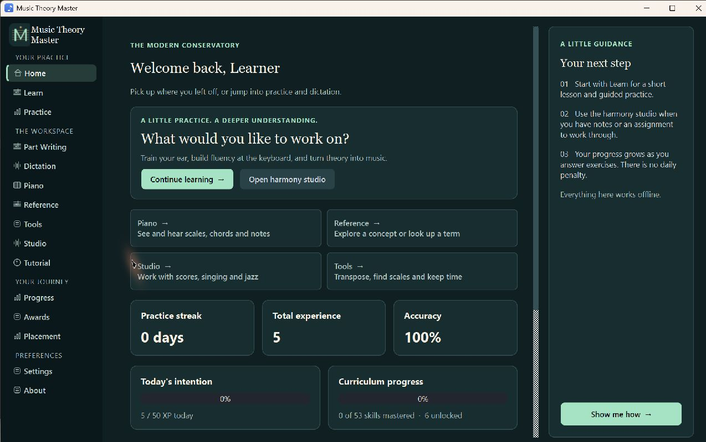

</div>

## The Modern Conservatory redesign

A shared layout brings each workspace into the same visual system: compact icon navigation, an editorial heading, task cards, a music canvas and a contextual **Your next step** guide. Ink-green panels, mint actions and ivory manuscript paper follow the [generated four-workspace design reference](docs/design/workspace-system-concept.png). Screenshots below show the **actual native application**. [Design decisions and generation brief](docs/design/BRAND.md) are included.

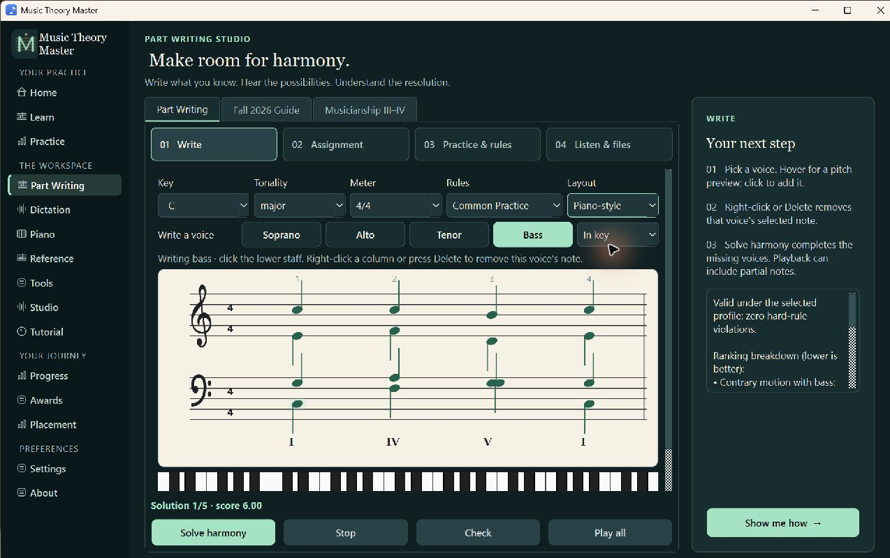

### Learn by doing

The first launch opens **Tutorial**. **Your first harmony** is a seven-step, approximately four-minute walkthrough in the real editor: choose Bass, place C3, place F3, remove and replace a note, solve the missing voices, request playback and inspect the assignment table. A ring marks the target pitch. Wrong pitches get specific correction feedback; Continue unlocks only after the action succeeds.

The tutorial uses its own score store. It does not overwrite an assignment or award course XP. **Pause & leave** saves your place; **Tutorial** offers Resume, Restart or Replay as appropriate. Resuming after a solve restores your notes and asks you to solve again. **Explore on my own** skips onboarding, and every workspace's **Show me how** button returns to its guide. The tutorial hub explains all workspaces; the harmony walkthrough is the action-checked tour.

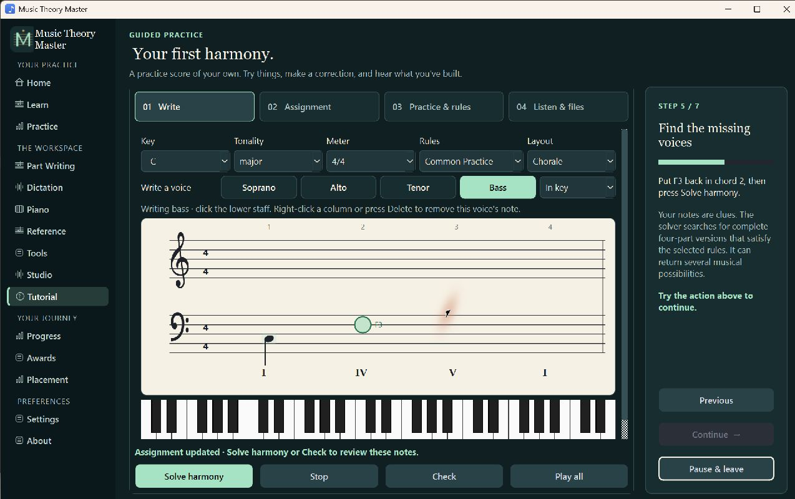

### Write directly on the score

1. Open **Part Writing** and choose the key, tonality, meter, rules and layout.
2. Select **Soprano, Alto, Tenor or Bass**. Click the corresponding staff at a numbered chord column. Hover previews the pitch. Unknown voices stay blank, so a single bass note appears immediately.
3. **In key** follows the key signature. Choose Natural, Sharp, Flat or a double accidental to override it. The status identifies the pitch, voice and chord entered.
4. Right-click a column on that voice's staff, or focus the score and press **Delete**, to remove the selected voice's note. Left/right arrows move between chord columns.
5. Press **Solve harmony** for ranked completions, **Check** for feedback, or **Play all** to hear the notes already entered, including partial scores. Staff and piano entry also audition the pitch.

The compact piano stays under the score in **Write**. It enters notes into the selected voice/slot; selecting several voice cells in the table applies a piano note to all selected cells. Computer-keyboard piano controls remain available when the piano has focus. **Solve harmony**, **Stop**, **Check** and **Play all** remain below the task canvas as you switch tasks or scroll a long score. Stop cancels a search or stops playback.

| Task | Available tools |
|---|---|
| **Write** | Key, tonality, meter, rule profile, layout, voice and accidental controls; direct staff entry and the compact piano. |
| **Assignment** | Harmony labels, durations and exact clues; paste aligned rows; add/remove/duplicate/reorder slots, locks, detailed slot constraints and auto-correction. |
| **Practice & rules** | Practice type, difficulty, unique-solution option and Generate; cadence, result count, search budget/width and custom profile editing. |
| **Listen & files** | Previous/next solution, reveal practice answer, explanation, voice/chord/transition/comparison playback, Save/Open JSON, MusicXML export and Reset. |
| **Guidance rail** | Task-specific instructions plus complete diagnostics and ranking feedback. |

Course guides remain in the smaller tabs above these tasks. All existing workspaces, course content, audio/MIDI settings, themes, progress data and import/export features remain. Long scores scroll; switching Chorale, Piano-style and Open score preserves a displayed solution. Clefs use consistent ink-bound placement, separate from meter and key signatures.

### Focused modules

**Practice** starts with All skills, Theory, Ear training or Keyboard, followed by a topic and a separate adaptive-difficulty row. **Reference**, **Tools**, **Studio** and **Piano** use module cards with guidance that follows the selected module. Tool fields use balanced columns and distinct primary actions.

In **Studio → Score study**, open MusicXML/MXL or **Try a sample score**. The pitch overview appears first; expand **Passage setup** for parts, measures, voice, tempo and review thresholds. The overview groups pitches at the first twelve selected attack times; it is not a full engraved reproduction of the imported score. Playback and analysis still use the selected passage, including its note lengths and internal rests.

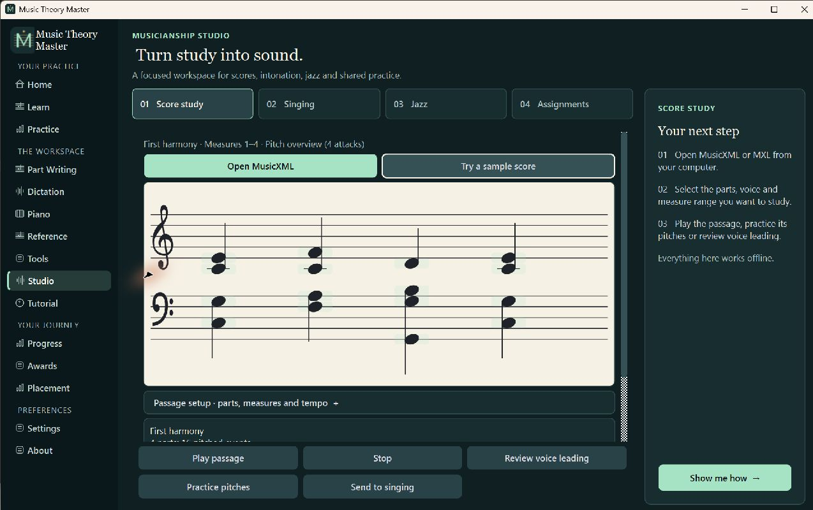

The dedicated **Piano** workspace also uses a proportional keyboard and a notation preview for played notes, scales and chords. Natural and accidental tonic choices work across all twelve roots; selecting a low note switches its preview to bass clef.

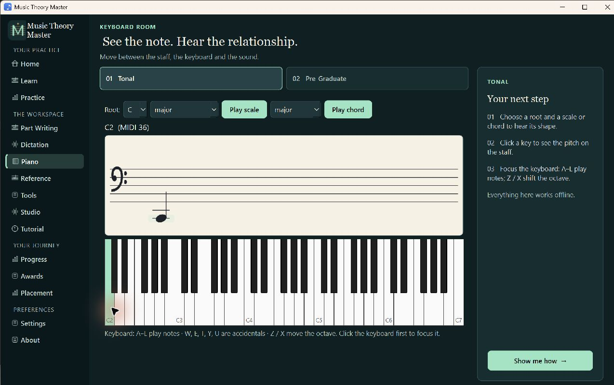

**Review evidence:** successive dedicated reviewers compared the design reference and exercised the native application with mouse and keyboard. The second cycle starts with a stricter [Generation 5 baseline](docs/design/generation-5-review.md), followed by [Generation 6](docs/design/generation-6-review.md), [Generation 7](docs/design/generation-7-review.md) and further reviews recorded in the [validation record](docs/design/VALIDATION.md). Reports distinguish visual inspection, completed interactions and untested hardware.

Install **v1.5.0 or newer** for this interface and tutorial. The Windows icon uses the same conservatory mark as the sidebar. Earlier releases use the previous interface. Older feature screenshots farther down this guide document the earlier visual theme, with their feature descriptions retained.

## Start here

| Your starting point | Where to go |
|---|---|
| New to the app | Start **Tutorial → Your first harmony**, or choose Explore on my own. |
| New to theory | Begin **Learn**. Read a short lesson, hear examples, then practice; placement is optional. |
| Returning learner | Take **Placement** with breadth checks. Choose theory, aural and/or piano; results suggest a provisional starting point and review topics. |
| Working on an assignment | Open **Part Writing** for constrained SATB; use **Reference** for note/rhythm analysis and **Tools** for transposition, scales and worksheets. |
| Studying a score or preparing a class assignment | Open **Studio**: import MusicXML, practice a selected voice, compare a recording, study jazz or exchange an offline assignment. |
| Practicing an instrument | Use **Piano**, MIDI input, **Tools → Metronome**, or **Tools → Fretboard**. |
| Preparing for advanced classes | Follow the tonal III–IV sequence before the **Pre-Graduate** bridge; guided topics are labeled separately from graded drills. |

### Install for Windows

Download one file from [Releases](https://github.com/Eipckz/music-theory-master/releases/latest):

| Download | Use |
|---|---|
| `MusicTheoryMaster-Setup.exe` | Per-user installer with Start-menu shortcut and uninstaller. |
| `MusicTheoryMaster.exe` | Portable app; no Python installation needed. Replace an older portable copy to update. |
| Matching `.sha256` | Verify the corresponding download's checksum. |

Runtime is offline: no account, telemetry or cloud service. Source tests also run on Linux; prebuilt downloads are Windows-only. Release builds test the actual executable before uploading it, including the Windows DLL startup fix introduced in v1.1.

## Every workspace

| Navigation | Complete feature guide |
|---|---|
| **Home** | Daily learning goal, XP, streak, progress summary, suggested learning and review actions. |
| **Learn** | Prerequisite-based skill tree, teach-then-drill lessons, playable examples and staff illustrations, hints and answer explanations, adaptive difficulty, due reviews, weak-skill review, lesson recap and per-skill results. |
| **Practice** | Select theory/aural/piano, choose any registered exercise, set difficulty, generate another item or focus the weakest topic. |
| **Dictation** | Shortcut into listening practice; melody, rhythm, harmony and multipart exercises, unlimited replay and pitch-preserving playback-speed adjustment where supported. |
| **Part Writing** | SATB solver/checker/corrector, generated practice, assignment grid and paste, custom profiles, grand/open-score notation, playback, JSON and MusicXML; III–IV roadmap and Fall 2026 guide. |
| **Piano** | Play the on-screen or MIDI keyboard, audition scales and triads/sevenths; realize pitch-class collections, ordered row segments and P/L/R transformations. |
| **Reference** | Circle of fifths, staff/keyboard explorer, free note analysis, exact rhythm/meter calculator, post-tonal clock/set/matrix/P-L-R workbench and searchable playable glossary. |
| **Tools** | Spelled transposition and instrument conversion, reverse scale finder, accented/subdivided metronome and tap tempo, printable worksheets/answer keys, custom-tuning fretboard. |
| **Studio** | MusicXML/MXL passages, pitch-entry practice, independent-line voice-leading review, microphone/WAV pitch feedback, jazz progression player and offline assignment/result exchange. |
| **Tutorial** | Isolated, resumable seven-step harmony walkthrough with action validation, correction feedback and guides to every workspace. |
| **Progress** | Every skill's level, unlock state, mastery estimate, attempts and guided status, plus overall accuracy and completion counts. |
| **Awards** | Achievement gallery, earned milestones and dismissible celebrations; reduce motion is available. |
| **Placement** | Selectable domains, adaptive staircase, confirmation, optional breadth checks, sound check, explicit unknown response, cancel without saving, evidence-based provisional results and safe retakes. |
| **Settings** | Profile name; audio backend, SoundFont, instrument, output device, volume and tempo; MIDI device and keyboard note labels; theme, accent, scaling and staff appearance; progress reset with confirmation. |
| **About** | Version, attribution, offline status and application information. |

## Musicianship studio — new in v1.4

### Score practice and voice-leading review

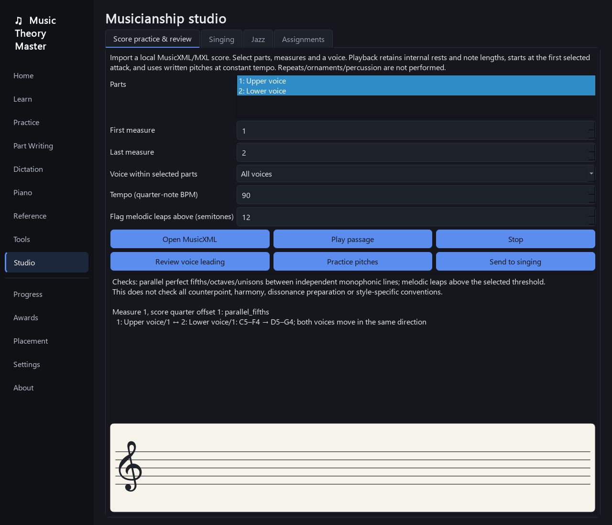

Open a local `.musicxml`, `.xml` or compressed `.mxl` score, select parts, a voice and an inclusive measure range, then set quarter-note BPM. **Play passage** retains note lengths, ties and internal rests and begins at the first selected pitched attack. **Practice pitches** turns a monophonic selection of up to 32 notes into an ordered pitch-entry exercise; **Send to singing** transfers up to 256 timed target notes for recording comparison. Imported practice does not alter course XP or mastery. Staff previews show supplied pitches, not a full engraved score.

**Review voice leading** examines independent monophonic lines across the selected score, with measure/offset locations and actual note pairs. It flags parallel perfect fifths, octaves/unisons and contiguous melodic leaps exceeding your chosen threshold. Polyphonic or overlapping lines are explicitly excluded. Fourths are not flagged. The review does not assess all counterpoint, nonchord-tone treatment, harmonic function or style-specific conventions; use the SATB lab for its more detailed four-part rule profiles.

Import limits: 8 MB per file, 1–32 parts and 6,000 written note/rest elements. Compressed archives have additional member/size limits and are read without extraction. External entities are rejected. Playback is limited to three minutes, uses written pitches and constant tempo, and does not perform repeat expansion, instrument transposition, ornaments, grace notes or percussion. Tied notes are included according to their starting measure. Microtones and accidentals beyond doubles are rejected.

### Singing and instrumental intonation

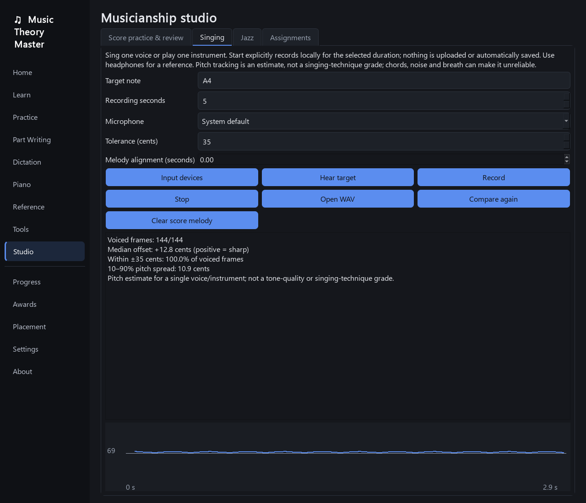

Choose a target note, input device and 1–30 seconds, then press **Record**. **Stop** ends capture and analyzes it; navigating away closes the microphone and discards an active capture. **Open WAV** works without a microphone. Nothing is uploaded or automatically saved. Use headphones when hearing the reference so speaker playback does not enter the recording.

The pitch trace and report show voiced frames, median sharp/flat offset, pitch spread and the proportion within a 5–100-cent tolerance. Imported melodies are compared note by note with a manual alignment offset of ±10 seconds; missing/unvoiced recording time is not a match. There is no recorded count-in or automatic rhythm grade. **Clear score melody** returns to target-note practice. Recording comparison assumes A4 = 440 Hz and estimates one voice/instrument, roughly 60–1,000 Hz. WAV input accepts 8–192 kHz and at most 30 seconds; multichannel audio is averaged to mono. Chords, breath and background noise can confuse pitch estimation. This is practice feedback, not a grade for vocal technique or tone quality. The screenshot uses a synthesized test tone, not a claimed human performance evaluation.

### Jazz harmony, listening and keyboard study

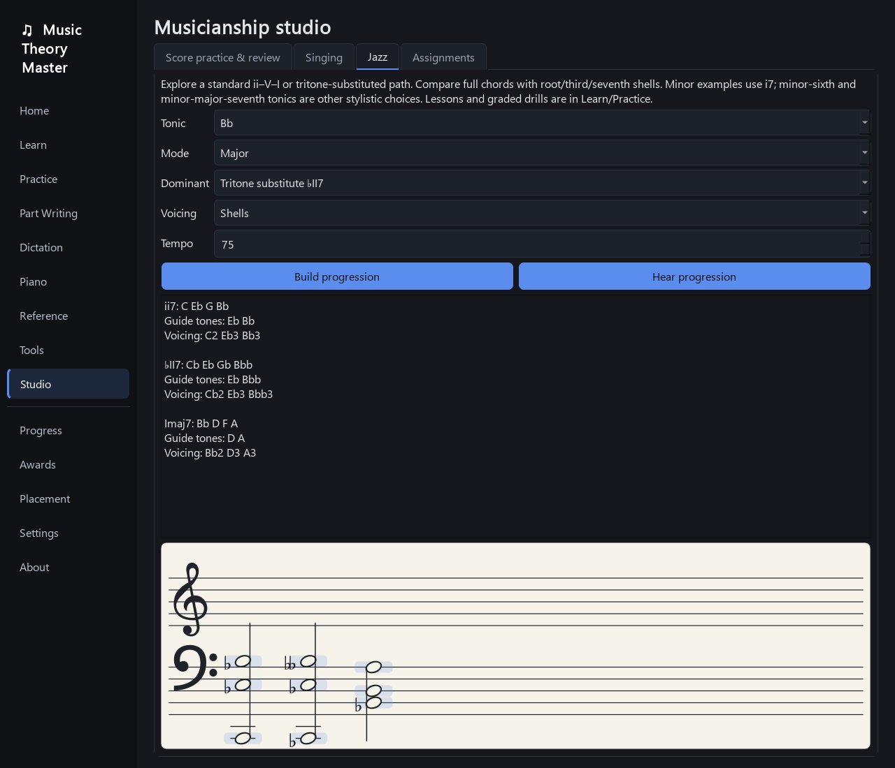

Explore major/minor ii–V–I in twelve tonic choices, replace V7 with its tritone substitute, compare full chords with root/third/seventh shells, inspect spelled guide tones and hear the progression at your tempo. Five prerequisite-connected **Learn** skills and **Practice** exercises cover chord functions, third/seventh identification, substitutions, hearing standard versus substituted bass paths and playing shell pitch classes. Minor examples use i7 as one tonic vocabulary choice; lessons discuss alternatives. This does not grade improvised solos, comping rhythm or physical fingering.

### Offline teacher assignments

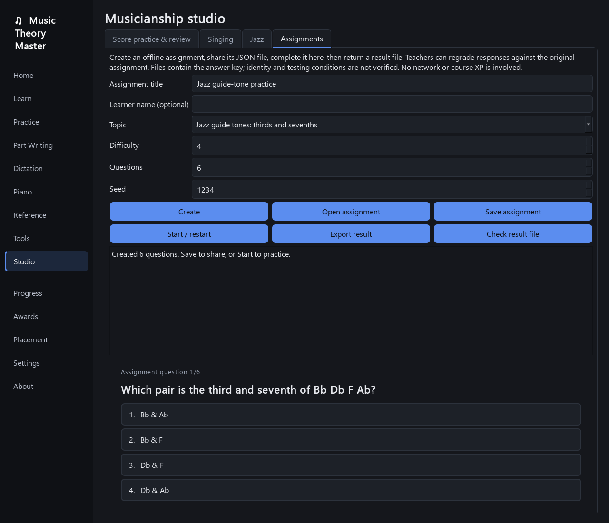

Create 1–50 questions from one of 23 supported written, listening or keyboard topics at difficulty 0–10 with a reproducible seed. **Save assignment** exports a JSON file; another user opens it, presses **Start / restart**, answers the questions and exports a result. Load the original assignment and use **Check result file** to regrade the submitted responses independently of the file's claimed score. No course progress is fabricated.

Assignment and result files are limited to 2 MB and validated on import. They include the answer key and are intended for shareable practice: identity and testing conditions are not verified. This release keeps assignment exchange offline; there is no teacher account, class roster, automatic submission or cloud collection.

## Five practice tools

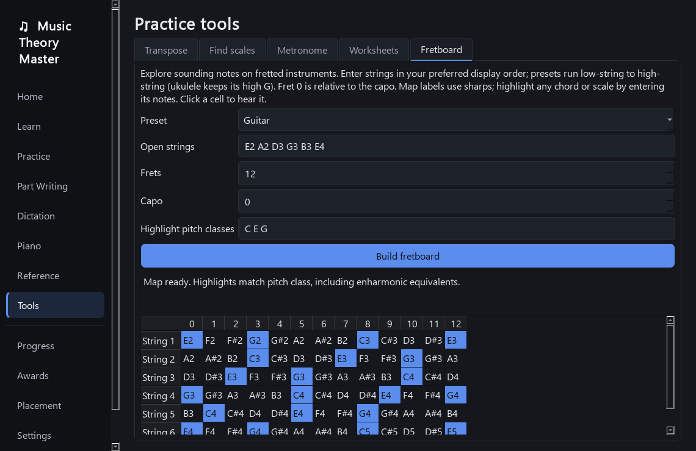

### 1. Transposition studio

Enter a melody such as `C4 E4 G4`, choose an interval such as `M2`, and select up/down. Results preserve diatonic spelling (`D4 F#4 A4`), can be auditioned and exported as MusicXML. Instrument presets convert written ↔ concert pitch for Bb trumpet/clarinet, A clarinet, F horn, Eb alto sax, Bb tenor sax and octave-transposing guitar. Press **Apply instrument preset** to use the conversion. Input supports 1–128 notes and MIDI 0–127; unrepresentable spellings/ranges are rejected. Export represents each supplied pitch as a quarter note, not inferred rhythm.

### 2. Reverse scale finder

Supply notes, optionally constrain the tonic, and allow zero, one or two outside pitch classes. Candidates list scale notes, missing members and outside tones and can be played. Sorting prioritizes fewer outside/missing notes. Major/Ionian and natural minor/Aeolian are combined; melodic minor means its ascending form. Pitch-class containment alone cannot establish a key or tonal center.

### 3. Metronome and tap tempo

Set 20–300 BPM, beat groups such as `4` or `2+3`, 1–4 subdivisions and 1–32 bars (up to three minutes per run). Downbeats, group starts, other beats and subdivisions have different click accents. **Stop**, changing settings or leaving the page stops the run. Tap tempo uses recent inter-tap intervals; a long pause restarts measurement. For compound 6/8, use two beats with three subdivisions at dotted-quarter BPM. For additive 5/8, use `2+3` at eighth-note BPM.

### 4. Printable custom worksheets

Select multiple supported written topics, difficulty 0–10, 1–50 questions and a reproducible seed. Preview the sheet, then export questions and answer key separately as standalone HTML. Print or save as PDF from your browser. Topics cover interval construction, triad spelling, Roman-numeral construction and all seven III–IV reasoning families. Questions contain the needed written information; audio-only drills are excluded. Worksheets do not award XP or claim instructor verification.

### 5. Fretboard explorer

Choose guitar, bass, high-G ukulele or drop-D guitar, or enter 1–12 custom open-string pitches. Set 1–24 frets and capo 0–12. The clickable table displays sounding notes, highlights supplied chord/scale pitch classes, and auditions individual positions. Fret numbers are relative to the capo; display order follows the entered strings. Labels use sharps and highlights recognize enharmonic equivalents. This does not automatically choose playable fingerings.

## Reference and listening

| Tool | What it supports |
|---|---|
| Circle of fifths | Click a major key; inspect its signature, relative minor, primary chords and hear examples. |
| Explorer | Pick a root and inspect/play intervals, scales/modes, triads or seventh chords with staff and keyboard views. |
| Analyze notes | Enter 1–64 spelled pitches; inspect MIDI/frequency (A4 = 440 Hz), directed adjacent intervals, lowest pitch, chord-collection name and possible major/minor Roman analysis. Play supplied pitches or copy the report. Missing notes and context can change the interpretation. |
| Rhythm & meter | Exact duration totals per bar; whole through thirty-second notes, rests, one/two dots, triplets and fractional whole-note values. Separate bars with `|`; see short/overfilled bars and simple/compound beat explanations. A pickup may intentionally be short. Does not validate beaming, ties or accent. |
| Post-tonal bridge | Clickable pitch-class clock; normal/prime form, interval vector and Forte class; Tn/TnI transforms; validated twelve-tone row and 12×12 matrix with P/I labels, reverse reading for R/RI; audible neo-Riemannian P/L/R chains and keyboard highlights. |
| Glossary | Search definitions and play examples where supplied. |

Rhythm example: `t(e) t(e) t(e) q h` fills 4/4 exactly; `e e e e e e` fills 6/8. The duration calculator and performance metronome serve different tasks.

All supported scale collections: **major, natural minor, harmonic minor, melodic minor, ionian, dorian, phrygian, lydian, mixolydian, aeolian, locrian, major pentatonic, minor pentatonic, blues, whole tone, octatonic hw, octatonic wh, chromatic**.

## SATB assignment workbench

Open **Part Writing** in the sidebar. Blank harmony or voice cells are unknowns; a visible `LOCK` is immutable. The table accepts exact pitches (`F#4`), octave-free pitch classes (`Bb`), scale degrees (`scale degree 3` or `^3`), and chord factors (`root`, `third`, `fifth`, `seventh`). **Slot constraints…** adds exact bass, inversion, required doubling, allowed/forbidden tones or harmonies, and display clefs. Successful solutions are independently revalidated and contain zero hard violations under the selected profile.

Use **Paste assignment…** for longer exercises. Omit rows you do not have; every supplied row must have the same number of pipe-separated cells. `?`, `-`, and empty cells mean unknown. Supplied voice clues are locked on import. For example:

```text
Roman: I | IV | V7 | I
S: E4 | F4 | ? | E4
B: C3 | ? | G2 | C3
```

You can instead use `Chords: C | Dm7 | G7 | C`, `Figures: ? | 6 | 7 | ?`, and a `Duration:` row in beats. Import replaces the current table; save an exercise first if you want to keep both. Key, mode, cadence and profile remain selected.

**Chord vocabulary:** diatonic triads/sevenths and inversions, applied dominants, mixture, cadential six-four, N6, It+6/Fr+6/Ger+6, and music21 chord symbols such as `Dsus4`, `Cadd9`, `C9`, and `G7/B`. For a sonority without a conventional symbol, enter a root-first collection such as `notes:C E G Bb` in the Chord symbol row. Custom collections accept 2–7 distinct pitch classes with distinct letter names. These represent sounding chord members, not a rhythmic suspension model.

**Four voices and larger chords:** SATB outputs exactly four simultaneous notes. Chords with more than four members use a defined reduction: bass, third and seventh when present, plus the highest extension (13, then 11, then 9); other members are optional. Custom collections follow that same policy. For a different reduction, enter the intended members with `notes:` or use required/forbidden tones. Asking for five mandatory distinct notes in SATB correctly produces no solution. An arbitrary number of independent voices, rests, ties and automatic non-chord-tone realization are not supported.

**Unknown harmony and ambiguity:** blank slots search the built-in major/minor diatonic vocabulary. Use Slot constraints → Allowed harmonies for explicit chromatic alternatives, including chord symbols. A fragment such as I–?–IV does not uniquely determine a missing chord. Results are completions valid under the selected profile, not a claim about the instructor's sole intended answer. The lab does not automatically change key mid-exercise; analyze modulation sections in their local keys.

**Search:** the default uses a bounded width for practical assignment work. Results are independently checked; ranking is among explored paths. A limit or unsuccessful bounded search does not prove impossibility. Raise seconds/width, add assignment clues, or choose width zero for exhaustive ranking within the time/node budget. There is no fixed chord-slot cap, but larger unconstrained problems require more search. Saved files preserve the full exercise. For incomplete tonic voicings, use Edit profile → disable Require complete triads when your course permits them.

See [theory sources and coverage](docs/theory-sources.md) for teaching references and the relationship to the Auralia/Musition workflow.

The expandable panels also support creating/opening/saving problems, adding/duplicating/removing/reordering slots, lock toggling, solving/checking/correcting, practice generation, profile editing, cancellation, result selection and playback/export. Undo/redo is not implemented; save a JSON copy before making changes you may want to reverse. Diagnostics explain the constraints; supplied locked clues are preserved. Grand staff and open score are display options, not additional generated voices.

## Placement and adaptive learning

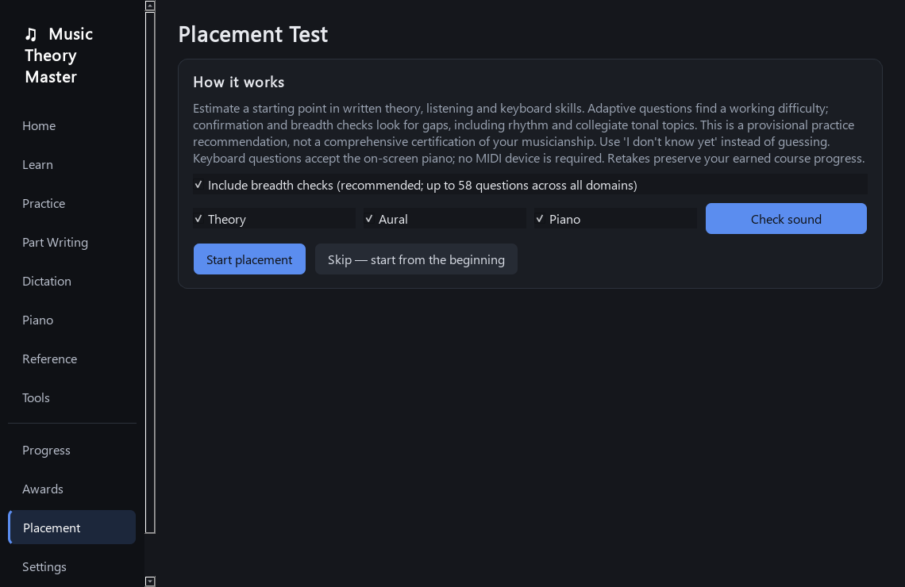

The initial assessment estimates theory, listening and keyboard separately. The recommended mode includes topic breadth checks after its adaptive staircase and confirmation questions: written fundamentals, rhythm and listening skills, keyboard basics, and collegiate tonal topics when the working difficulty warrants them. With all domains selected it asks at most 58 questions and may finish earlier. A shorter mode omits breadth checks; unchecked domains are explicitly unassessed. There is no speed score or question timer. Use the sound check before listening questions and **I don't know yet** instead of guessing.

Results show the number of questions and distinct exercise types, provisional level and topics missed. The app stores item-type/difficulty evidence locally. An easier retry is credited at its actual difficulty; an unrelated fallback cannot masquerade as an advanced item. Canceling does not save a partial assessment. A retake can seed a better starting point without deleting earned mastery.

During learning, Elo-style ratings, Bayesian knowledge estimates and an FSRS-inspired review schedule adapt practice. Prerequisites and repeated successful work unlock skills; XP, daily goals, streaks and achievements track engagement. These are educational heuristics, not a standardized or psychometrically validated examination, and cannot certify someone's complete musicianship.

## Full curriculum

The sequence is **Beginner → Early → Intermediate → Advanced → Pre-Graduate → Graduate**. Advanced includes seven Musicianship III–IV skills: modes, dominant tendency tones, nonchord tones, cadences/phrases, applied dominants, mixture/chromatic predominants and modulation. The III–IV roadmap offers checkpoints; the Fall 2026 companion covers MUS 2710/2730/2750 with tentative instructor-dependent dates clearly labeled.

For example, in C major, G7 = G–B–D–F: its **third B normally rises to C**, while its **seventh F normally falls to E**. The lessons explain local-key context and classroom exceptions. Post-tonal study starts by distinguishing key-relative scale degrees from fixed pitch classes before introducing sets, rows and P/L/R. Guided topics offer lessons and self-check, not automatic grading of full compositions or reductions.

The current app contains **56 curriculum skills** and **59 selectable exercise families**.

<details>
<summary>Beginner</summary>

| Skill | Domain | Practice |
|---|---|---|
| Note Names & the Staff | Theory | Note Identification, Place the Note |
| Hearing Intervals | Aural | Interval Recognition (Ear) |
| Melodic Dictation | Aural | Melodic Dictation |
| Keyboard Geography | Piano | Play a Note |
| Rhythmic Dictation | Aural | Rhythmic Dictation |

</details>

<details>
<summary>Early</summary>

| Skill | Domain | Practice |
|---|---|---|
| Intervals (Written) | Theory | Interval Identification, Interval Construction |
| Key Signatures | Theory | Key Signatures, Build Key Signatures |
| Scale Spelling | Theory | Scale Spelling |
| Scale Identification | Theory | Scale Identification |
| Triad Quality | Theory | Triad Quality |
| Triad Spelling | Theory | Triad Spelling |
| Play Intervals | Piano | Play an Interval |
| Play Scales | Piano | Play a Scale |
| Chord Quality (Ear) | Aural | Chord Quality (Ear) |
| Scales & Modes (Ear) | Aural | Scale / Mode (Ear) |

</details>

<details>
<summary>Intermediate</summary>

| Skill | Domain | Practice |
|---|---|---|
| Seventh-Chord Quality | Theory | Seventh-Chord Quality |
| Inversions & Figured Bass | Theory | Chord Inversions & Figured Bass, Build Chords in Inversion |
| Roman-Numeral Analysis | Theory | Roman-Numeral Analysis |
| Build From Roman Numerals | Theory | Build From Roman Numeral |
| Play Chords | Piano | Play a Triad |
| Cadence Identification | Aural | Cadence Identification (Ear) |
| Error Detection | Aural | Error Detection |
| Species Counterpoint | Theory | Guided self-study |

</details>

<details>
<summary>Advanced</summary>

| Skill | Domain | Practice |
|---|---|---|
| Musicianship III: Modes in Context | Theory | Modes: characteristic scale degrees |
| Musicianship III: V7 Tendency Tones | Theory | V7: third versus seventh resolution |
| Musicianship III: Non-Chord Tones | Theory | Passing, neighbor, suspension, anticipation |
| Musicianship III: Cadences & Phrases | Theory | Cadences and phrase structure |
| Musicianship III–IV: Applied Dominants | Theory | Applied dominants and temporary leading tones |
| Musicianship IV: Mixture & Chromatic Predominants | Theory | Mixture, Neapolitan, augmented sixths |
| Musicianship IV: Modulation & Tonal Evidence | Theory | Tonicization versus modulation |
| Harmonic Dictation | Aural | Progression Recognition (Ear), Harmonic Dictation |
| Multi-Part Dictation | Aural | Multi-Part Dictation |
| Chromatic Harmony | Theory | Roman-Numeral Analysis |
| Four-Part Writing | Theory | Four-Part Writing |
| Form & Phrase Structure | Theory | Guided self-study |
| Jazz ii–V–I | Theory | Jazz ii–V–I chord functions |
| Guide Tones & Shell Voicings | Theory | Jazz guide tones: thirds and sevenths |
| Tritone Substitution | Theory | Tritone substitutions |
| Hear Jazz Bass and Guide Tones | Aural | Hear standard and substituted ii–V–I |
| Play Jazz Shells | Piano | Play root, third and seventh |

</details>

<details>
<summary>Pre-Graduate</summary>

| Skill | Domain | Practice |
|---|---|---|
| Pitch Classes & the Chromatic Clock | Theory | Pitch Classes: Notes ↔ Numbers, Pitch-Class Clock |
| Interval Classes 1-6 | Theory | Interval Classes 1–6 |
| PC Sets: Normal Form | Theory | PC-Set: Normal Form |
| PC Sets: Prime Form | Theory | PC-Set: Prime Form |
| Interval-Class Vectors | Theory | PC-Set: Interval Vector |
| Forte Set-Class Tables | Theory | PC-Set: Forte Name |
| Tn / TnI Operations | Theory | Tn / TnI Transformation |
| Twelve-Tone Rows & Matrices | Theory | 12-Tone: Identify Row Form, 12-Tone: Matrix Lookup |
| Neo-Riemannian P/L/R | Theory | Neo-Riemannian Transformation |
| Hear Interval Classes | Aural | Hear an Interval Class |
| Hear Pitch-Class Collections | Aural | Hear Pitch-Set Cardinality |
| Hear P/L/R Voice Leading | Aural | Hear P/L/R Voice Leading |
| Realize Pitch-Class Sets | Piano | Play a Pitch-Class Set |
| Realize Row Segments | Piano | Play a Row Segment |
| Play P/L/R Transformations | Piano | Play a P/L/R Transformation |

</details>

<details>
<summary>Graduate</summary>

| Skill | Domain | Practice |
|---|---|---|
| Schenkerian Analysis | Theory | Guided self-study |

</details>

### Every selectable exercise

<details>
<summary>Theory exercise catalog</summary>

| Exercise | Registry ID |
|---|---|
| Applied dominants and temporary leading tones | `applied_target` |
| Chord Inversions & Figured Bass | `chord_inversion` |
| Mixture, Neapolitan, augmented sixths | `chromatic_function` |
| V7: third versus seventh resolution | `dominant_tendency` |
| PC-Set: Forte Name | `forte_identification` |
| Interval Classes 1–6 | `interval_class_identification` |
| Interval Construction | `interval_construction` |
| Interval Identification | `interval_identification` |
| Build Chords in Inversion | `inversion_build` |
| Jazz guide tones: thirds and sevenths | `jazz_guide_tones` |
| Jazz ii–V–I chord functions | `jazz_ii_v_i` |
| Tritone substitutions | `jazz_tritone_sub` |
| Build Key Signatures | `key_signature_build` |
| Key Signatures | `key_signature_identification` |
| Modes: characteristic scale degrees | `modal_degree` |
| Tonicization versus modulation | `modulation_evidence` |
| Neo-Riemannian Transformation | `neo_riemannian` |
| Passing, neighbor, suspension, anticipation | `nonchord_tone` |
| Note Identification | `note_identification` |
| Place the Note | `note_placement` |
| Four-Part Writing | `part_writing_completion` |
| PC-Set: Interval Vector | `pcset_interval_vector` |
| PC-Set: Normal Form | `pcset_normal_form` |
| PC-Set: Prime Form | `pcset_prime_form` |
| Pitch-Class Clock | `pitch_class_clock` |
| Pitch Classes: Notes ↔ Numbers | `pitch_class_conversion` |
| Roman-Numeral Analysis | `roman_numeral_analysis` |
| Build From Roman Numeral | `roman_numeral_build` |
| 12-Tone: Identify Row Form | `row_form_identification` |
| 12-Tone: Matrix Lookup | `row_matrix_lookup` |
| Scale Identification | `scale_identification` |
| Scale Spelling | `scale_spelling` |
| Tn / TnI Transformation | `set_transposition` |
| Seventh-Chord Quality | `seventh_quality` |
| Cadences and phrase structure | `tonal_phrase` |
| Triad Quality | `triad_quality` |
| Triad Spelling | `triad_spelling` |

</details>

<details>
<summary>Aural exercise catalog</summary>

| Exercise | Registry ID |
|---|---|
| Cadence Identification (Ear) | `cadence_ear` |
| Chord Quality (Ear) | `chord_quality_ear` |
| Error Detection | `error_detection` |
| Harmonic Dictation | `harmonic_dictation` |
| Interval Recognition (Ear) | `interval_recognition` |
| Hear standard and substituted ii–V–I | `jazz_progression_ear` |
| Melodic Dictation | `melodic_dictation` |
| Multi-Part Dictation | `multipart_dictation` |
| Hear Pitch-Set Cardinality | `pcset_cardinality_ear` |
| Hear P/L/R Voice Leading | `plr_transformation_ear` |
| Hear an Interval Class | `posttonal_interval_ear` |
| Progression Recognition (Ear) | `progression_ear` |
| Rhythmic Dictation | `rhythmic_dictation` |
| Scale / Mode (Ear) | `scale_mode_ear` |

</details>

<details>
<summary>Piano exercise catalog</summary>

| Exercise | Registry ID |
|---|---|
| Play an Interval | `play_interval` |
| Play root, third and seventh | `play_jazz_shell` |
| Play a Note | `play_note` |
| Play a Pitch-Class Set | `play_pitch_class_set` |
| Play a P/L/R Transformation | `play_plr_transform` |
| Play a Row Segment | `play_row_segment` |
| Play a Scale | `play_scale` |
| Play a Triad | `play_triad` |

</details>


## Input, appearance and accessibility

- Answer with choices, text, staff notes, on-screen/MIDI piano, ordered sequences, rhythmic values or separate voice lines. Correct answers include explanations; relevant exercises provide hints, audio and staff reveals.
- Keyboard shortcuts include numbered choices, `R` replay, `Backspace` delete, `Enter` submit/advance and `Z`/`X` piano octave shifts. Staff construction supports mouse and keyboard entry. Accessible names and note descriptions support assistive technology; usability varies with the platform's screen reader.
- Dark, light, high-contrast and sepia themes; selectable accents, UI scaling, reduce motion, keyboard note names, staff size, notehead style, note labels, paper color and line/space highlighting.
- Engraving includes spaced accidentals, chord stacks, stem directions, rhythmic note values, key/time signatures and barlines. Theme contrast is covered by automated tests; printable worksheets deliberately use a white page.
- Instant built-in synthesis, optional bundled FluidSynth/SoundFont, ten instrument choices, adjustable output device/volume/tempo, and MIDI input. If the preferred audio backend fails, the synth fallback remains available.

<details>
<summary>Visual tour and retained demo gallery</summary>

Earlier-version recordings illustrate the established workflows; the feature guide above describes current behavior.

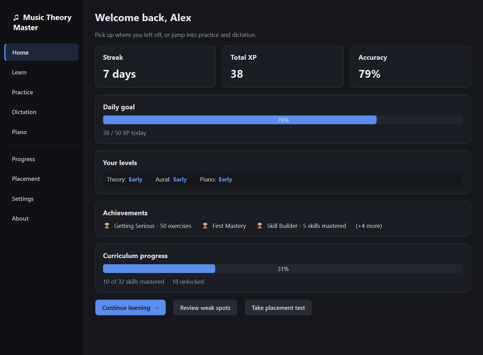
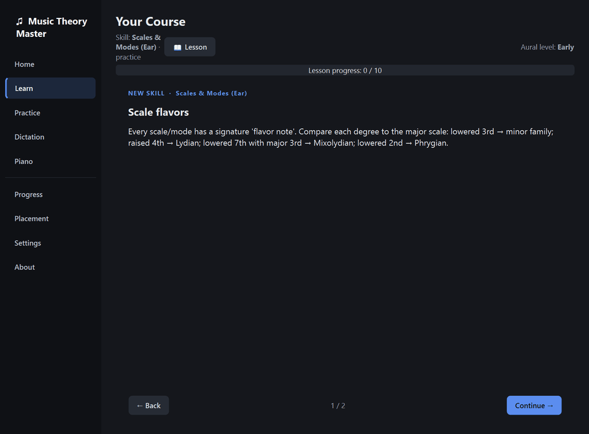
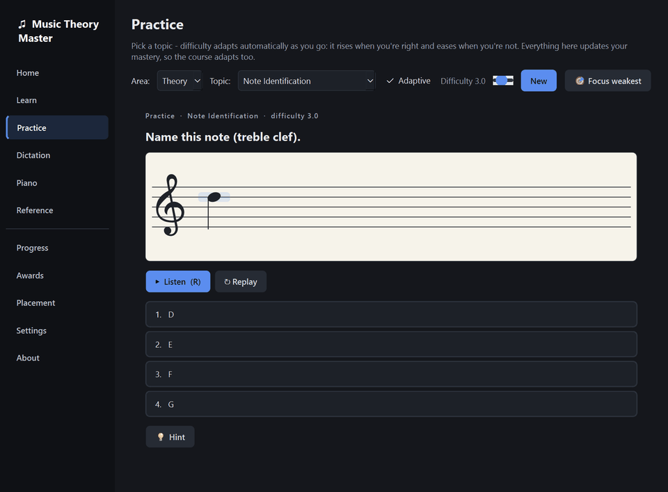

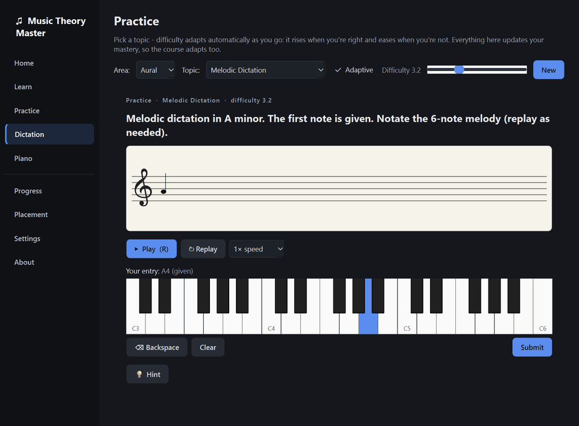
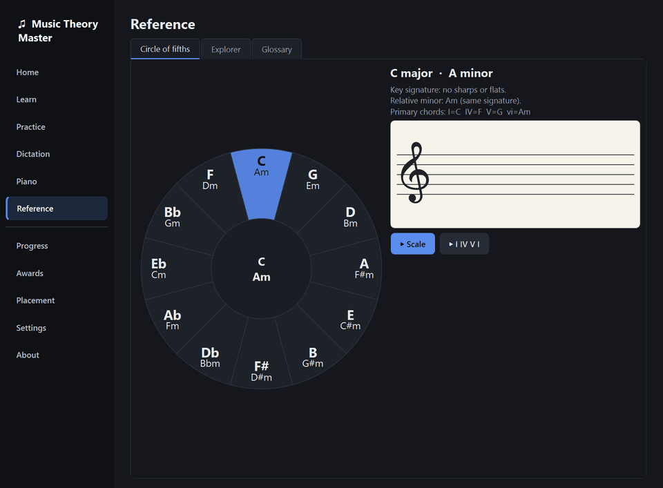
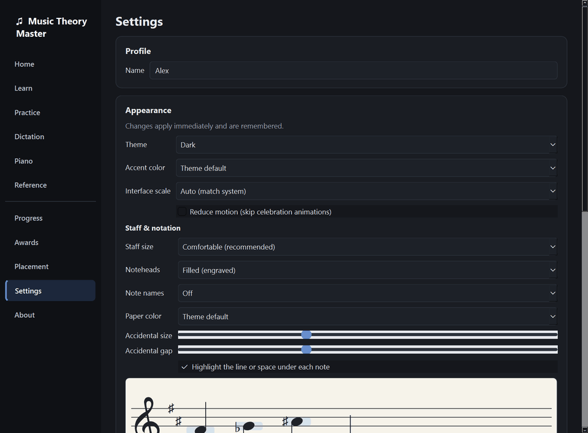
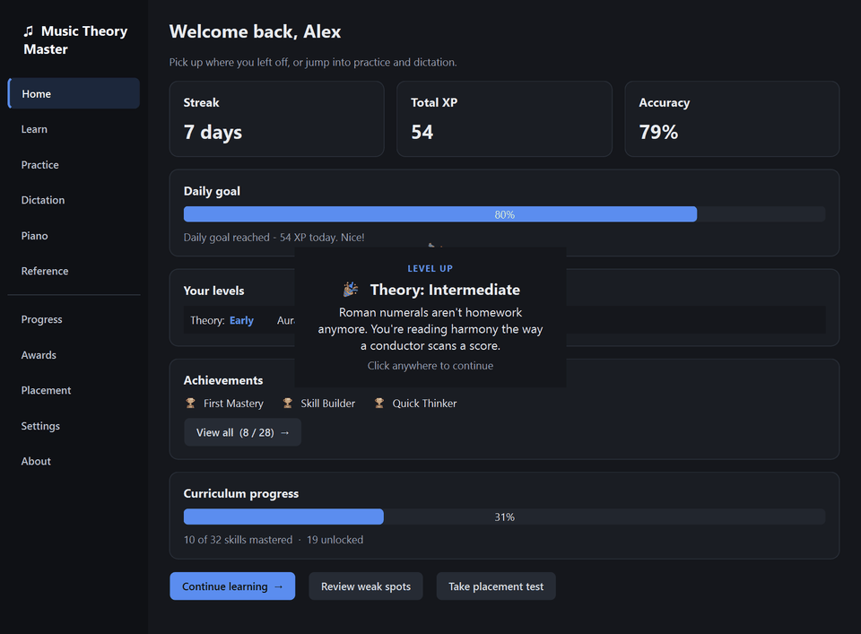
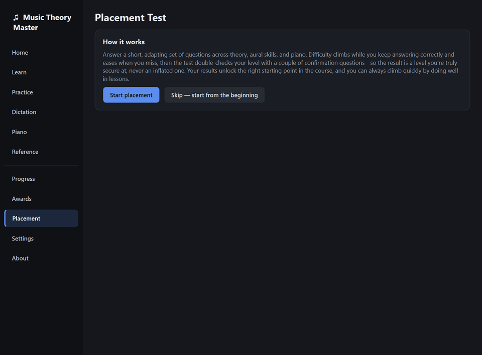
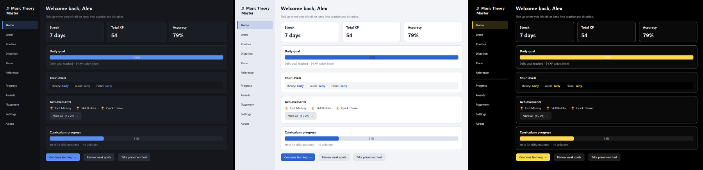

</details>

## Files, privacy and boundaries

| Data | Location or format |
|---|---|
| Learning progress | Per-user local SQLite database: attempts, mastery, placement, XP, achievements and metadata. |
| Preferences | Local Qt settings under the application identity. |
| SATB assignments | User-saved JSON; solved scores export to MusicXML. |
| Transposed melody | User-selected MusicXML file; quarter-note durations. |
| Worksheets | Separate local HTML question and answer files; no external fonts or scripts. |
| Imported scores / recordings | Local MusicXML/MXL and WAV; microphone samples stay in memory and are not automatically saved. |
| Teacher practice exchange | Local `.mtm-assignment.json` and `.mtm-result.json` files, with an answer key and independently regradable responses. |
| Reports | Copy note/rhythm analysis to the clipboard. |

Reset in Settings deletes learning progress after confirmation; it is not a backup tool. Runtime makes no network calls and requires no account. Build-time audio downloads are version-pinned and hash-checked. SQL uses parameters; imported assignments are validated. See [SECURITY.md](SECURITY.md).

The app is not a general score editor, universal harmony oracle, teacher cloud service or replacement for your instructor. SATB is four-part and has explicit search limits; note collections do not prove tonal function; guided advanced topics do not imply doctoral-level automated assessment. The [audit and competitor comparison](docs/expansion-audit.md) records earlier coverage; the [v1.4 Studio expansion](docs/studio-expansion.md) documents the new workflows, sources and validation.

## Build and contribute

Python 3.12+; Windows release builds use Python 3.13.

```powershell
git clone https://github.com/Eipckz/music-theory-master.git
cd music-theory-master
python -m venv .venv
.venv\Scripts\Activate.ps1
python -m pip install -r requirements.txt -r requirements-dev.txt
python main.py
```

```powershell
python -m pytest tests -q
ruff check --select E9,F63,F7,F82,F401,F811 music_theory tests build main.py
python build/fetch_audio_assets.py  # optional source-run SoundFont; hash-verified
./build.ps1                      # Windows portable exe + checksum + actual exe test
```

CI tests Windows/Linux on Python 3.12/3.13. Tests cover theory, generator self-grading, placement simulations, SATB constraints and exports, tool calculations, MusicXML/MXL import safety, WAV pitch estimates, assignment round trips and GUI behavior, storage, rendering, themes and offline operation. The Windows build runs `--self-test` against the actual frozen executable with an isolated profile. Tagged `vX.Y.Z` builds add an Inno Setup installer and publish both artifacts and checksums.

| Source area | Responsibility |
|---|---|
| `theory/` | Spelled musical math, SATB search/rules, sets/rows/P-L-R and practice calculators. |
| `exercises/` | Registered generators, answer/input contracts and offline assignments/results. |
| `curriculum/` | Skill prerequisites, lessons and the course companion. |
| `adaptive/` | Placement, mastery and review scheduling. |
| `audio/` | Synth, SoundFont rendering, event timing, MIDI, explicit microphone capture and monophonic pitch analysis. |
| `ui/` | Qt screens, exercise player, notation, piano and theme/accessibility behavior. |
| `storage/` | Local progress and settings. |

[Contributing](CONTRIBUTING.md) · [Developer guide](CLAUDE.md) · [Theory sources](docs/theory-sources.md) · [Changelog](CHANGELOG.md) · [Future expansion skill](skills/expand-music-theory-master/SKILL.md)

MIT licensed. Created by Fable Five and ChatGPT 6 Astra.
